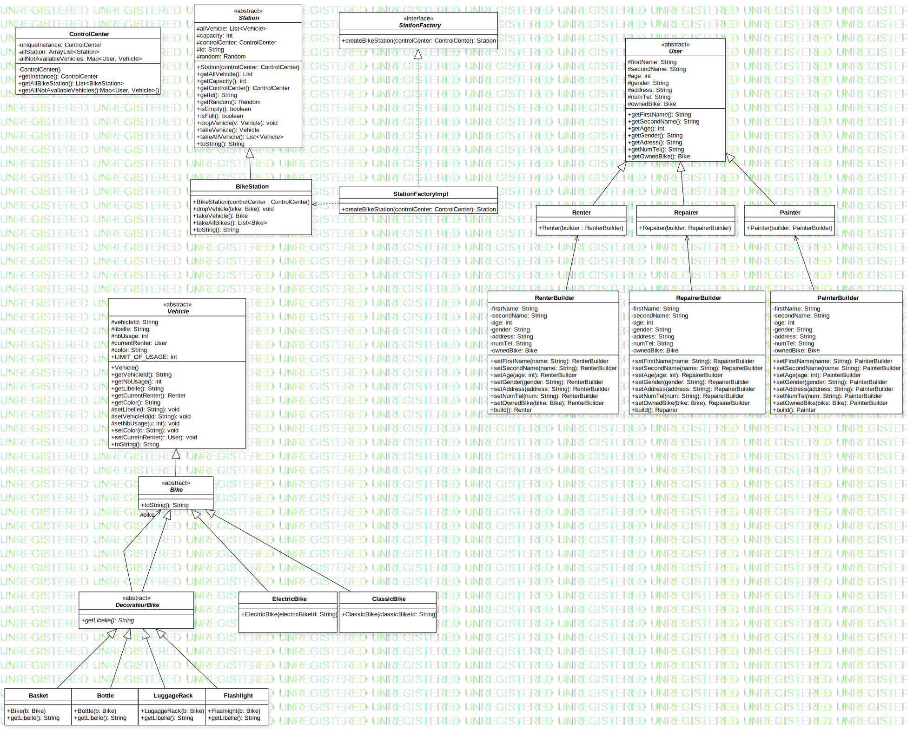

# Projet : Velos Libre Service 

## Membre du Projet 

- Adam RAMJATTAN
    - Numéro étudiant : 42140181
    - L3 INFO
    - Groupe 6

## Architecture du depôt 

1. Le dossier **src/VLille** contient tous les fichier source du projet
2. Le dossier **test/VLille** contient tous les fichier test du projet
3. Le fichier **UML Projet VeLib.mdj** est l'Uml du projet
4. Le fichier **UML.svg** est l'Uml du projet mais en format svg
5. Le fichier **UML.pdf** est l'Uml du projet mais en format pdf
6. Le fichier **Makefile** est un makefile

## UML



## Explication de l'Uml

1. Les objets de type Vehicle / se trouvant dans le dossier src/VLille/vehicle
    - La classe **Vehicle** est une classe abstraite servant de parent pour tout les types de vehicule
        - La classe **Bike** est également une classe abstraite servant de parent pour tout les types de vélo et qui herite de Vehicle / se trouvant dans le dossier src/VLille/vehicle/Bike
            - La classe **ElectricBike** représente tout les vélo électrique, cette classe hérite donc de la classe Bike
            - La classe **ClassicBike** représente tout les vélo classic, cette classe hérite donc de la classe Bike
            - La classes **DecorateurBike** représente le decorateur servant a decorer les différent types de vélos
                - Les classes **Basket**, **Bottle**, **Flaslight** et **LuggageRack** héritent toutes les 4 de la classe DecorateurBike et représente les différents équipements que peut avoir un vélos. Ces classes se trouvent dans le dossier equipment

2. Les objets de type User / se trouvant dans le dossier src/VLille/User
    - La classe **User** est une classe abstraite servant de parent a tous les autres objets de type User, un User est un utilisateur qui vas interagir avec un velo et une station pour soit deposer le velo ou le prendre
        - La classe **Repairer** herite de User, elle represente un reparateur qui a la capacité de réparer un vélo
        - La classe **Painter** herete de User, elle represente un peintre qui a la capacité de changer la couleur d'un vélo
        - La classe **Renter** herite de User, elle represente un utilisateur qui utilise un vélo, donc qui auras la capacité sois de deposer ou de prendre un velo dans une station

3. Les objets de type Station / se trouvant dans le dossier src/VLille/Station
    - La classe **Station** est un classe représantant les stations dans lequel des objet de type Vehicle peuvent y être déposés ou retiré. Cette classe est la classe parente de toute les classes de type Station donc également de BikeStation
    - La classe **BikeStation** est une classe representant les stations dans lequel uniquement des objets de type Bike peuvent y être déposés ou retirés
    - L'interface **StationFactory** est une interface servant a créer des stations 
    - La classe **StationFactorylmpl** est la classe concrete de l'interface StationFactory

4. Les objets de type ControlCenter / se trouvant dans le dossier src/VLille/controlCenter
    - La classe **ControlCenter** représente le centre de controle de la ville qui se charger de superviser l’ensemble de la flotte de vélos et des stations, elle est impementé en utilisant le pattern Singleton

## Pattern utilisé (justification de leur utilisation) :
- **Singleton** : Sur la classe ControlCenter car dans mon projet je veut avoir que un seul et unique centre de controle
- **Decorator** : Sur la Bike, j'aurais aussi pu utiliser ce pattern sur la Vehicle, mais préféré le faire sur la classe Bike. 
- **Factory Method** : Je l'ai utilisé sur la classe Station car on pourrais peut être rajouter d'autre type de station autre que des BikeStation.
- **Builder** : sur les User car un objet user possede beaucoup de caractéristiques, donc j'utilise le pattern builder pour simplifier le création d'un objet de type User
- **State** : implementation du pattern State pour représenter les différents états des objets Vehicle (Broken, Rented, Not rented, Stealed)
- **Strategy** : 

# Commande de compilation (depuis la source du projet):
Pour compiler tout les fichier : ```make```, les fichiers compilés se trouvent dans le fichier **class**

Pour lancer le **Main** : ```make run```

## Déroulement du projet : 
### Semaine 1 :
Commencement de la création de l'Uml du projet sans l'utilisation des pattern.

Implémentaion de certaines classes sans l'uilisation des pattern : Bike, BikeStation, ControlCenter, User, Equipment

### Semaine 2 :
Décision de quel pattern vont être utilisé lors du projet :

    - pattern Builder pour les User
    - pattern Factory pour les Station
    - pattenr Decorator pour les Vehicle
    - pattern Singleton pour le ControlCenter

Implemention de certaines classes avec cette fois-ci l'utilisation des pattern : User, Painter, Repairer, Renter

### Semaine 3 :
Implemention de certaines classes avec cette fois-ci l'utilisation des pattern : Vehicle, Bike, ClassicBike, ElectricBike, DecorateurBike, Basket, Bottle, Flashlight, LuggageRack

Implemention de certaines classes avec cette fois-ci l'utilisation des pattern : ControlCenter, Station, BikeStation, StationFactory, StationFactorylmpl

### Semaine 4 :
Debut de l'implementation de ControlCenter avec le pattern Observer et ajout d'un état dans un Vehicle pour savoir si le vehicule est disponible ou non 

### Semaine 5 :
Décision de quels patterns vont être ajoutés dans le projet :

    - pattern Strategy pour l'algorithme de distribution du ControlCenter
    - pattern State sur la classe State représentant le statut/état d'un Vehicle

Implementation compléte du pattern State sur les Vehicle ainsi que son ajout dans l'UML, ainsi que l'implementation des méthodes qui permettent des louer un Vehicle depuis une station et de déposer un Vehicle dans une station, pour pouvoir les appeler dans les Actions des User.

### Semaine 6 :
Implementation des actions des User, ainsi que début de l'implementation de l'algorithme de distribution via le pattern Strategy, et fin de l'UML.
Implementation des tests du projet et du Main.