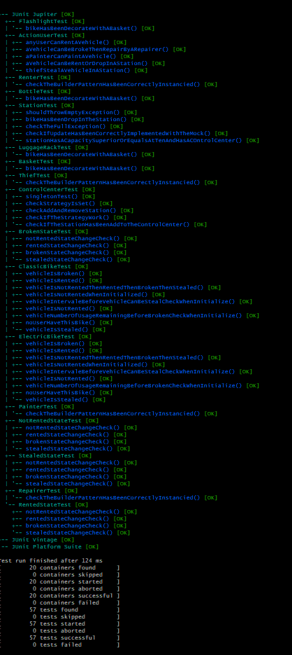
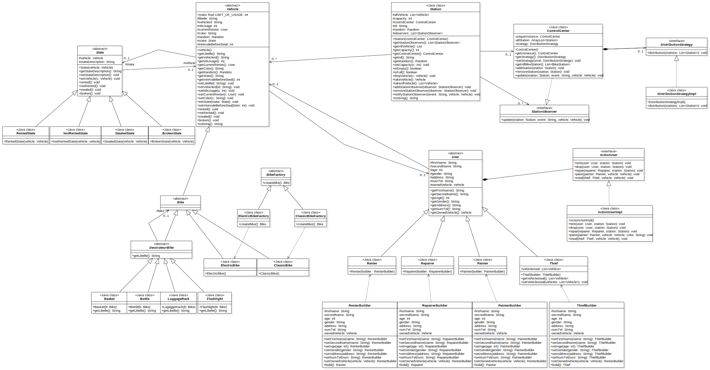

# Projet : Velos Libre Service 

## Membre du Projet 

- Adam RAMJATTAN
    - Numéro étudiant : 42140181
    - L3 INFO
    - Groupe 6

## Architecture du depôt 

1. Le dossier **src/VLille** contient tous les fichier source du projet
2. Le dossier **test/VLille** contient tous les fichier test du projet
3. Le dossier **UML** contient différent format/extension de l'uml dont le format *pdf*
4. Le fichier **junit-platform-console-standalone-1.9.3** est le Junit necessaire pour exécuter les tests
5. Le fichier **Makefile** est un makefile utile pour exécuter les commandes de la rubrique *How to*

# How to (depuis la source du projet) :
## Compilation des fichiers source et test :
Pour compiler tout les fichier, exécuté : ```make all```, les fichiers compilés se trouvent dans le dossier **class**

## Executer les test :
Pour exécuter les tests, exécuté : ```make test```, vous devriez alors obtenir quelque chose comme ça :



## Executer le Main :
Pour lancer le **Main**, exécuté : ```make run```

## Générer la documentation :
Pour Générer la javadoc, exécuté : ```make docs```, la documentation seras alors générer dans un dossier **docs**

## Jar
Pour créer un jar du main, exécuter la commande : ```make jar```, le jar seras alors créer dans le dossier jar sous le nom *VLille.jar*
Pour le lancer le jar, exécuter la commande : ```java -jar jar/VLille.jar``` après l'avoir créer

# UML



## Explication de l'Uml

1. Package **VLille.vehicle**
    - La classe **Vehicle** est une classe abstraite servant de classe parent pour toutes les classes de types Vehicle
    - La classe **State** est une classe abstraite servant de classe parent pour toutes les classes de types State
        - La classe **BrokenState** représente l'état "cassé" d'un vehicule
        - La classe **RentedState** représente l'état "loue" d'un vehicule
        - La classe **NotRentedState** représente l'état "non loue" d'un vehicule
        - La classe **StealedState** représente l'état "volé" d'un vehicule

2. Package **VLille.vehicle.Bike**
    - La classe **Bike** est une classe abstraite servant de parent pour tout les types de vélo et qui herite de Vehicle
        - La classe **ElectricBike** représente tout les vélo électrique, cette classe hérite donc de la classe Bike
        - La classe **ClassicBike** représente tout les vélo classic, cette classe hérite donc de la classe Bike

3. Package **VLille.vehicle.Bike.equipement**
    - La classes **DecorateurBike** représente le decorateur servant a decorer les différent types de vélos
        - Les classes **Basket**, **Bottle**, **Flaslight** et **LuggageRack** héritent toutes les 4 de la classe DecorateurBike et représente les différents équipements que peut avoir un vélos

4. Package **VLille.user**
    - La classe **User** est une classe abstraite servant de parent a tous les autres objets de type User, un User est un utilisateur qui vas interagir avec un velo et une station pour soit deposer le velo ou le prendre
        - La classe **Repairer** herite de User, elle represente un reparateur qui a la capacité de réparer un vélo
        - La classe **Painter** herite de User, elle represente un peintre qui a la capacité de changer la couleur d'un vélo
        - La classe **Renter** herite de User, elle represente un utilisateur qui utilise un vélo, donc qui auras la capacité sois de deposer ou de prendre un velo dans une station
        - La classe **Thief** herite de User, elle représente un voleur qui a la capacité de pouvoir voler des vélos depuis différentes stations
    - L'interface **ActionUser** est une interface dans toutes les actions que peuvent effectuer les User vont être modéliser.
        - La classe **ActionUserlmpl** est la classe concrete de cette même interface dans lequel on vas implémenter les actions

5. Package **VLille.Station**
    - La classe **Station** est un classe représantant les stations dans lequel des objet de type Vehicle peuvent y être déposés ou retiré.

6. Package **VLille.controlCenter**
    - La classe **ControlCenter** représente le centre de controle de la ville qui se charger de superviser l’ensemble de la flotte de vélos et des stations, elle est implementé en utilisant le pattern Singleton et implemente l'interface StationObserver
    - L'interface **StationObserver** représente les différents observer qui vont recevoir des notifications, en fonctions de certaines situations, provenat d'objets de type Station.
    - L'interface **DistributionStrategy** représente les différentes strategie de distribution dont le centre de contrôle pourras faire usage.
    - La classe **DistributionStrategy** représente la strategie de distribution que le centre de contrôle vas utiliser par defaut.

# Pattern
## Design patterns utilisé :
### Singleton :
- ControlCenter

### Decorator :
- Bike
- DecorateurBike
- Basket
- Bottle
- LuggageRack
- Flashlight

### Builder :
- Renter
- Repairer
- Painter
- Thief

### State : 
- State
- RentedState
- NotRentedState
- StealedState
- BrokenState

### Strategy :
- ControlCenter
- DistributionStrategy
- DistributionStrategylmpl

### Factory Method
- BikeFactory
- ElectricBikeFactory
- ClassicBikeFactory
- ElectricBike
- ClassicBike

### Observer
- StationObserver
- ControlCenter
- Station

## Justification de l'utilisation des design patterns

- **Singleton** : Pour m'assurer que la classe ControlCEnter n'ai qu'une seule instance, car je ne veut que un centre de control dans mon systeme, et ainsi lui fournir un accés global.
- **Decorator** : Pour permettre aux objets Bike d'acquérir une certaine flexibilité et étendre leur fonctionnalité vis-à-vis des équipements qu'ils peuvent avoir.
- **Builder** : Un objet User doit renseigner son nom, prénom, age, genre, adresse, etc... ce qui en fait un objet complex, donc j'utilise ce pattern pour simplifier sa création.
- **State** : Pour représenter l'état d'un véhicule et ainsi modifier ce même état en fonction de certaines conditions. L'état de base d'un véhicule est *NotRentedState* ce qui représente l'état "non loué". De plus avec l'usage de ce pattern je pourrais tout à fait rajouter de nouveau états, comme par exemple *BurnedState* qui représenterais l'état "Brulé"
- **Strategy** : Pour représenter les différents algorithme de distribution que le centre de contrôle peut utiliser. Par defaut le centre de contrôle a pour strategie *DistributionStrategylmpl*, mais avec ce patter il est tout a fait possible de rajouter de nouvelle strategie et de les interchanger.
- **Factory Method** : Pour rendre le systéme extensible a l'ajout de nouveau objet Vehicle comme la trotinette sans modifier le code existant et également pour pouvoir hiérarchiser les classes.
- **Observer** : Pour pouvoir envoyer des "notifications" au centre de contrôle depuis une station lorque celle-ci ajoute ou enleve un objet des ces slots. J'ai implementé une liste d'observer (*StationOberver*) dans ma classe Station, pour permettre a la station d'envoyer des notifications a tous les observer. 

## Déroulement du projet : 
### Semaine 1 :
Commencement de la création de l'Uml du projet sans l'utilisation des pattern.

Implémentaion de certaines classes sans l'uilisation des pattern : Bike, BikeStation, ControlCenter, User, Equipment

### Semaine 2 :
Décision de quel pattern vont être utilisé lors du projet :

    - pattern Builder pour les User
    - pattern Factory pour les Station
    - pattenr Decorator pour les Vehicle
    - pattern Singleton pour le ControlCenter

Implemention de certaines classes avec cette fois-ci l'utilisation des pattern : User, Painter, Repairer, Renter

### Semaine 3 :
Implemention de certaines classes avec cette fois-ci l'utilisation des pattern : Vehicle, Bike, ClassicBike, ElectricBike, DecorateurBike, Basket, Bottle, Flashlight, LuggageRack

Implemention de certaines classes avec cette fois-ci l'utilisation des pattern : ControlCenter, Station, BikeStation, StationFactory, StationFactorylmpl

### Semaine 4 :
Debut de l'implementation de ControlCenter avec le pattern Observer et ajout d'un état dans un Vehicle pour savoir si le vehicule est disponible ou non.

Décision d'implémenter le pattern Factory sur les Bike et non sur les stations

### Semaine 5 :
Décision de quels patterns vont être ajoutés dans le projet :

    - pattern Strategy pour l'algorithme de distribution du ControlCenter
    - pattern State sur la classe State représentant le statut/état d'un Vehicle

Implementation compléte du pattern State sur les Vehicle ainsi que son ajout dans l'UML, ainsi que l'implementation des méthodes qui permettent des louer un Vehicle depuis une station et de déposer un Vehicle dans une station, pour pouvoir les appeler dans les Actions des User.

### Semaine 6 :
Implementation des actions des User, ainsi que début de l'implementation de l'algorithme de distribution via le pattern Strategy, et fin de l'UML.
Implementation des tests du projet et du Main.